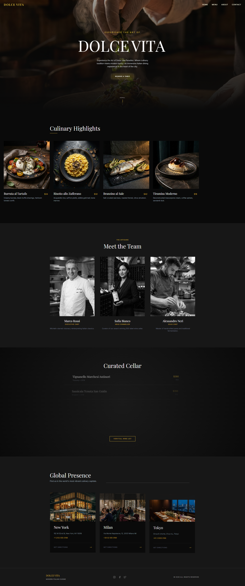

# Dolce Vita Paradiso

Un portafolio web inmersivo de alta gama para un restaurante italiano contemporáneo, construido con tecnologías web modernas para ofrecer una experiencia digital lujosa.



## 🌟 Descripción del Proyecto

**Dolce Vita Paradiso** está diseñado para reflejar la elegancia y sofisticación de un establecimiento con estrellas Michelin. El sitio web se centra en:

- **Narrativa Visual**: Imágenes generadas por IA de alta fidelidad y diseño atmosférico.
- **Interacciones Fluidas**: Animaciones complejas utilizando Framer Motion y GSAP.
- **Estética Moderna**: Un tema de lujo "dark mode" (modo oscuro) con acentos dorados y tipografía serif.
- **Responsividad**: Diseño totalmente adaptable para todos los dispositivos, incluyendo navegación móvil personalizada.

## ✨ Características Clave

- **Pantalla de Carga (Nueva)**: Una elegante introducción con el logo de la marca y una barra de estado que prepara al usuario para la experiencia.
- **Sistema de Reservas (Nuevo)**:
  - Al hacer clic en "Reserve a Table", se abre un formulario modal validado.
  - Campos para nombre, apellido, email, teléfono, fecha y hora.
  - Validación de todos los campos antes del envío.
  - Confirmación instantánea con un modal de "Thank You" (simulación, no envía datos al servidor).
- **Sección Hero**: Introducción cinematográfica a pantalla completa con revelación de texto y efectos de paralaje.
- **Menús Interactivos**:
  - **Destacados Culinarios**: Carrusel de desplazamiento horizontal que muestra platos de autor.
  - **Bodega Curada**: Lista de vinos elegante con efectos hover e información detallada.
- **Presencia Global**: Exhibición de ubicaciones en Nueva York, Milán y Tokio con imágenes atmosféricas.
- **El Equipo**: Sección "Conoce a los Artesanos" con retratos profesionales del chef ejecutivo, sommelier y sous chef.
- **Animaciones Orquestadas**:
  - Transiciones de página (Fade/Slide).
  - Revelaciones activadas por desplazamiento (Scroll-triggered).
  - Interacciones al pasar el cursor (Escala de grises a color, escalado).
  - Menú móvil con animación suave.

## 🛠️ Stack Tecnológico

- **Framework**: [React](https://react.dev/) 19 (via [Vite](https://vitejs.dev/))
- **Lenguaje**: [TypeScript](https://www.typescriptlang.org/)
- **Estilos**:
  - [Tailwind CSS](https://tailwindcss.com/) v4
  - [Sass](https://sass-lang.com/) (Módulos)
  - `clsx` & `tailwind-merge` para gestión de clases.
- **Animación**:
  - [Framer Motion](https://www.framer.com/motion/) (Interacciones UI, transiciones de página).
  - [GSAP](https://greensock.com/gsap/) (ScrollTrigger, secuencias complejas).
- **Enrutamiento**: [React Router](https://reactrouter.com/) v7.

## 🚀 Instalación y Configuración

1.  **Clonar el repositorio**:

    ```bash
    git clone https://github.com/tu-usuario/web-italian-restaurant.git
    cd web-italian-restaurant
    ```

2.  **Instalar dependencias**:

    ```bash
    npm install
    # o
    yarn install
    ```

3.  **Ejecutar el servidor de desarrollo**:

    ```bash
    npm run dev
    ```

4.  **Construir para producción**:
    ```bash
    npm run build
    ```

## 📂 Estructura del Proyecto

```
src/
├── assets/             # Activos estáticos (imágenes, fuentes)
├── components/
│   ├── animated/       # Componentes envoltorios para animación
│   ├── layout/         # Componentes de diseño (Navbar, Footer)
│   ├── ui/             # Elementos UI reutilizables (Botones, Modales, LoadingScreen)
│   ├── ReservationModal.tsx # Lógica del formulario de reserva
│   └── ThankYouModal.tsx    # Modal de confirmación
├── layouts/            # Envoltorio de diseño principal
├── pages/              # Páginas de ruta (Home, Menu, About, Contact)
├── styles/             # Estilos globales y mixins
├── constants.ts        # Fuente de datos/contenido centralizada
├── types.ts            # Interfaces y tipos TypeScript
└── main.tsx            # Punto de entrada
```

## 🎨 Créditos y Activos

Todas las imágenes de este proyecto fueron generadas utilizando herramientas avanzadas de IA para asegurar una estética consistente de "fotografía de comida oscura y melancólica" de alta gama.

## 📝 Licencia

Este proyecto es de código abierto y está disponible bajo la [Licencia MIT](LICENSE).

---

_Creado con pasión para Dolce Vita Paradiso._
